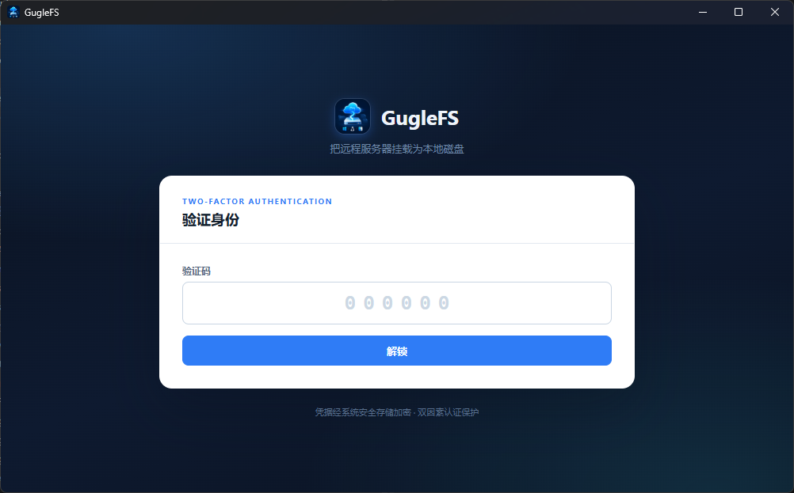
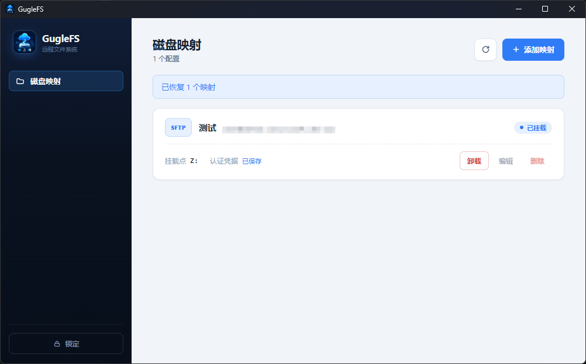
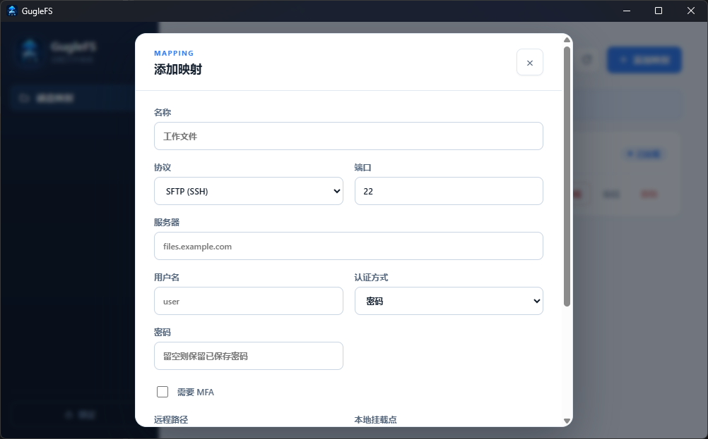
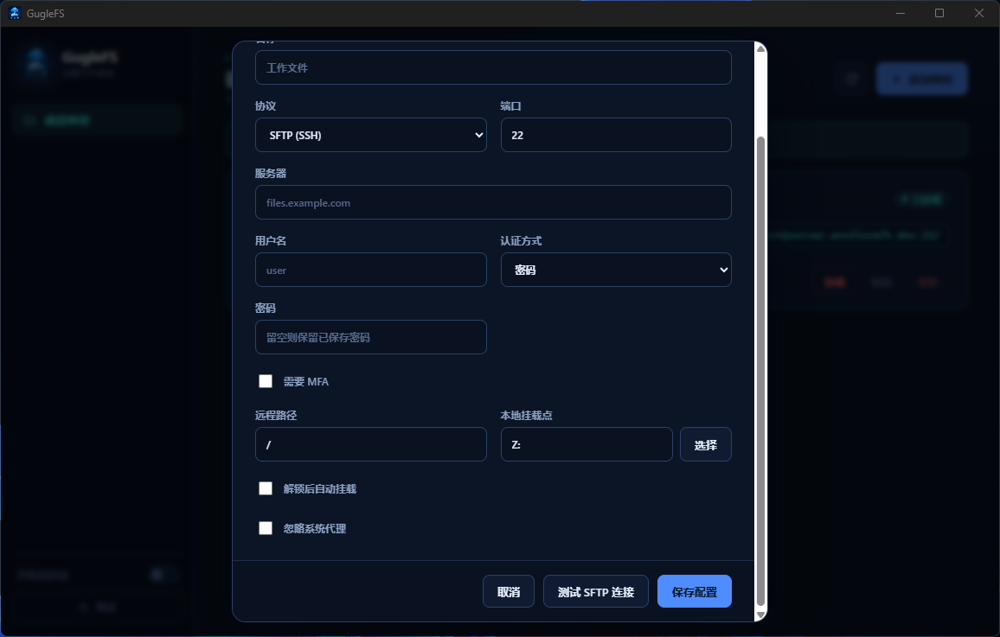
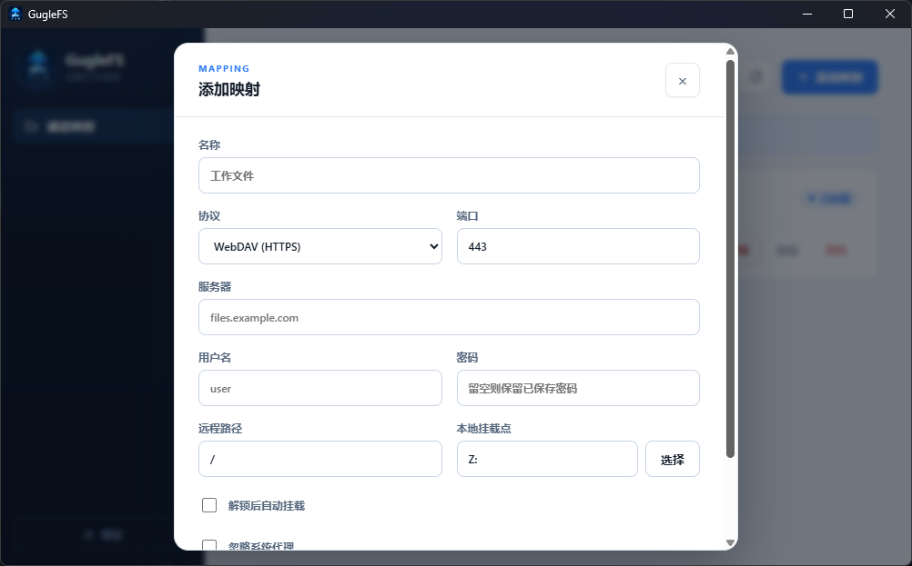

<div align="center">


# GugleFS

**Mount remote FTP, SFTP, and WebDAV paths as local drives.**

English | [简体中文](README.zh_CN.md)

</div>

GugleFS is a cross-platform Tauri desktop client that turns remote servers into local filesystems. Configure a mapping once, mount it, and the remote path behaves like any drive or directory on your machine — in every application, not just a file transfer window.

- **Three protocols, one UI** — FTP/FTPS, SFTP (password, private key, SSH Agent, MFA), and WebDAV (Basic, Digest, Bearer, or client certificate)
- **Native mounts** — WinFsp 2.1 on Windows, FUSE3 on Linux, FUSE-T 1.2.7 on macOS
- **Locked at startup** — TOTP two-factor authentication gates the app; credentials live in the OS secure store
- **Survives the network** — idle keepalives, silent reconnects, and mount recovery after restart
- **Fast by default** — bounded metadata caches and 1 MiB sequential read-ahead, shared across platforms

The desktop UI is built with Tauri, Vue 3, TypeScript, and Vite; the filesystem engine is Rust; packages are managed with pnpm.

## Screenshots

Unlock is protected by TOTP two-factor authentication:

<p align="center">
  
</p>

Mounted mappings show live status, endpoint, mount point, and credential state at a glance:

<p align="center">
  
</p>

Adding a mapping adapts to the protocol: SFTP offers password, OpenSSH/PEM private-key, SSH Agent, and MFA options; WebDAV offers Basic, Digest, Bearer Token, client-certificate, and anonymous authentication. Every mapping can be tested before it is saved:

<table>
  <tr>
    <td width="50%">
        
        
    </td>
    <td width="50%"></td>
  </tr>
  <tr>
    <td align="center"><sub>SFTP with password, key, SSH Agent, or MFA authentication</sub></td>
    <td align="center"><sub>WebDAV over HTTPS with selectable authentication</sub></td>
  </tr>
</table>

## Repository layout

```text
GugleFS/
|- src/                     # Configuration UI only
|- src-tauri/               # Tauri entry point and IPC commands
|- crates/
|  |- guglefs-core/         # Models, state, VFS, and engine traits
|  |- guglefs-remote/       # FTP, SFTP, and WebDAV adapters
|  `- guglefs-mount/        # WinFsp and FUSE drivers
|- docs/                    # README screenshots
|- THIRD_PARTY_LICENSES/    # Redistributed dependency licenses
|- Cargo.toml               # Rust workspace
|- package.json             # pnpm scripts
`- TODO.md
```

The dependency direction is `UI -> Tauri IPC -> core <- remote / mount`. The frontend never performs remote network requests or filesystem operations directly.

## Development

Install Node.js 20+, pnpm 10+, Rust 1.85.1+, and the Tauri prerequisites for your platform.

Windows additionally requires Visual Studio Build Tools 2022 with Desktop development with C++, a Windows 10/11 SDK, WebView2, and the WinFsp 2.1 SDK.

On Debian or Ubuntu:

```bash
sudo apt install fuse3 libwebkit2gtk-4.1-dev libayatana-appindicator3-dev \
  librsvg2-dev libxdo-dev libdbus-1-dev pkg-config
```

On macOS:

```bash
brew install --cask fuse-t
brew install pkgconf
export PKG_CONFIG_PATH="$PWD/scripts/pkgconfig/fuse-t${PKG_CONFIG_PATH:+:$PKG_CONFIG_PATH}"
```

Install dependencies and start the app:

```bash
pnpm install
pnpm dev
```

Run the frontend and Rust workspace checks:

```bash
pnpm check
```

## Mount runtimes

The Windows NSIS package includes and silently installs the official [WinFsp 2.1](https://github.com/winfsp/winfsp/releases) runtime. Mount points may be drive letters such as `Z:` or absolute directories. WinFsp creates directory mount points itself, so GugleFS temporarily removes an existing empty directory and restores it after a normal unmount. Non-empty directories are rejected, and stale WinFsp directory reparse points are recovered conservatively.

Windows mounts use case-insensitive lookup while preserving the spelling stored by the remote server. Exact-case matches win; if a remote directory contains multiple names that differ only by case, one deterministic entry is listed and an ambiguous non-exact lookup fails instead of opening the wrong file. New names reject Windows reserved devices, invalid characters, trailing spaces/dots, invalid UTF-16, and overlong components. Existing remote entries that Windows cannot represent are omitted from the mounted directory and must be renamed through a protocol-native client. Directories, dot-prefixed hidden entries, and regular-file archive attributes are projected; mutable Windows attributes and timestamps are not yet persisted when the remote protocol has no native equivalent.

Linux uses FUSE3 and absolute directory mount points. The DEB package declares `fuse3` and `libsecret-1-0` dependencies.

The macOS App and DMG contain the unmodified official FUSE-T 1.2.7 installer. When FUSE-T is missing, GugleFS shows an action that opens the bundled installer. Installation still requires administrator authorization, but FUSE-T runs in user space over a local NFS, SMB, or FSKit backend and does not require a kernel/system extension. Some applications may need access to Network Volumes under Privacy & Security > Files and Folders before they can browse a mount.

The FUSE-T binary license permits redistribution for non-commercial use. Commercial use or bundling with commercial software requires a commercial license from the FUSE-T authors. GugleFS pins the official installer SHA-256 and includes the [FUSE-T license](THIRD_PARTY_LICENSES/FUSE-T-LICENSE.txt) and [third-party attributions](THIRD_PARTY_LICENSES/FUSE-T-ATTRIBUTIONS.txt) in the repository and application bundle.

## Remote protocols

FTP uses passive mode and supports standard FTP and explicit FTPS. Deprecated implicit FTPS is not supported. When a proxy is active, both control and passive data connections use it. Pure-FTPd MLST/MLSD extensions, including four-digit `UNIX.mode` facts, are accepted without treating otherwise valid metadata as malformed.

SFTP supports passwords, OpenSSH/PEM private keys, and SSH Agent identities. Unix builds connect through `SSH_AUTH_SOCK`; Windows tries the configured agent pipe, the standard OpenSSH agent pipe, and Pageant. The file picker accepts keys with any filename, including extensionless `id_ed25519` and `id_rsa` files generated by `ssh-keygen`. Local-key mode stores only the path. Pasted keys and optional passphrases are stored in the platform secure store.

The first connection displays the server's SHA-256 host-key fingerprint; subsequent key changes require explicit confirmation. The mapping form can import OpenSSH `known_hosts` files, including hashed hostnames and non-default port entries. Import succeeds only when an entry matches the key currently presented by the server.

For an SFTP server that requires MFA, enable `Requires MFA` on the mapping and enter the current six-digit TOTP code when testing or mounting. The code is used only for that request and is never stored. MFA mappings cannot mount automatically. Idle SSH transports send protocol-level keepalives, and GugleFS silently reopens a closed SFTP subsystem while the authenticated SSH transport remains active. If the SSH transport itself closes, the mapping must be mounted manually with a new TOTP code. Non-MFA connections can reconnect and safely retry eligible operations automatically.

WebDAV requires HTTPS and supports Basic, Digest, Bearer Token, client-certificate, and anonymous authentication. Passwords and Bearer tokens use the platform secure store. Client-certificate mode reads a local combined PEM bundle containing the certificate chain and one unencrypted RSA, EC, or PKCS#8 private key; configuration stores only its local path, and portable exports remove that path.

WebDAV redirects stay on the original origin. Read-modify-write operations and truncation use a strong ETag with `If-Match`; weak or unavailable ETags fall back to `If-Unmodified-Since` when Last-Modified is present. A failed condition is returned to the filesystem as a busy/conflict error instead of silently overwriting a newer version. Servers that provide neither validator are serialized within one GugleFS mount process, but concurrent writes from another client can still use last-writer-wins semantics; GugleFS does not issue WebDAV `LOCK`/`UNLOCK` requests.

The mapping form can browse remote directories before saving. It uses the current form credentials, system proxy setting, SFTP host-key verification, and transient MFA code; selecting a directory writes its absolute path back to the mapping without persisting any temporary secret.

## System proxies

Mappings use the system proxy by default. Enable `Ignore system proxy` on a mapping to force direct connections.

Linux and macOS read the protocol-specific `HTTP_PROXY`, `HTTPS_PROXY`, `FTP_PROXY`, `SFTP_PROXY`, and `ALL_PROXY` environment variables, including lowercase variants, and honor `NO_PROXY`. Windows reads `ProxyEnable`, `ProxyServer`, and `ProxyOverride` from the current user's Internet Settings registry key.

WebDAV supports HTTP(S) and SOCKS5 proxies. SFTP, FTP, and FTPS use HTTP CONNECT or SOCKS5 tunnels. Proxy credentials remain in the operating-system proxy configuration and are never copied into `mappings.json`.

## Credentials and startup security

On first launch, GugleFS enrolls a TOTP authenticator and requires a six-digit code on subsequent launches. Passwords, WebDAV Bearer tokens, private-key passphrases, pasted keys, and the application-startup TOTP secret are stored in Windows Credential Manager, macOS Keychain, or Linux Secret Service. Mapping and recovery files contain only credential references and mapping IDs. SFTP MFA codes are transient and are not added to the secure store.

Locking the app safely unmounts active mappings before showing the 2FA screen. After unlock or restart, GugleFS restores mappings that were still mounted and have saved credentials, plus mappings with `auto_mount` enabled. A mapping explicitly unmounted by the user is not restored unless `auto_mount` is enabled. SFTP mappings that require MFA are always excluded from automatic restoration.

Mount and unmount commands run on Tauri's async runtime and serialize driver transitions in the backend. Every `mounting`, `unmounting`, `mounted`, `unmounted`, or `error` transition is emitted to the frontend, so manual actions, startup recovery, and lock-triggered unmounting share one live state source. These tasks remain attached to the application lifecycle so tray Exit can still stop every filesystem before the process exits.

GugleFS creates a fixed, non-sensitive `session-running` marker while the process is active and removes it only after a safe exit has stopped every process-owned mount. A marker left by a crash, forced termination, or unmount failure is detected on the next launch. After 2FA unlock, the existing recovery state remounts eligible mappings with saved credentials and the workspace asks the user to verify recent files and connections.

Closing the main window hides it in the system tray while mounts keep running. Double-clicking the tray icon opens and focuses the main window. The tray Exit command unmounts every filesystem created by the process before exiting. A single-instance guard prevents two GugleFS processes from claiming the same mount point.

The workspace and native dialogs are fully keyboard reachable. `Ctrl+N`/`Cmd+N` opens a new mapping dialog and `Ctrl+R`/`Cmd+R` refreshes mappings without reloading the webview. Dialogs focus their first relevant field, repeated mapping actions include the mapping name for assistive technology, and mount transitions and errors use live announcements.

The interface is available in English and Simplified Chinese. GugleFS follows the operating-system language on first launch, exposes a language switch on both the authentication screen and workspace, updates the native tray menu immediately, and keeps the user's selection locally for later launches.

## Performance

The shared VFS uses bounded short-lived caches: metadata for 3 seconds, directory listings for 2 seconds, and negative lookups for 1 second, with at most 4096 entries. Open files use 1 MiB sequential read-ahead. Create, write, truncate, rename, and delete operations update or invalidate relevant cache entries, including read-ahead buffers owned by other handles.

Each mounted mapping admits at most eight simultaneous remote operations. Control requests time out after 30 seconds and transfers after 120 seconds. Transient failures in reads, writes, truncation, timestamp updates, flushes, and connection setup receive one retry after a short backoff. FTP discards failed or timed-out sessions before that retry, SFTP rebuilds its session or SSH connection, and WebDAV uses the HTTP client's connection pool. Create, remove, and rename are never replayed after an ambiguous failure because the first request may already have taken effect.

Writes remain synchronous and write-through: GugleFS does not report success while data exists only in a background cache. The reviewed chunking, staged replacement, bounded encrypted spill, and crash-journal design is documented in [WRITE_STRATEGY.md](docs/WRITE_STRATEGY.md), together with the native-platform and protocol tests required before write-back can be enabled.

## Security boundary

`MappingConfig` stores credential IDs, local SSH/client-certificate private-key paths, pasted-key references, whether SFTP MFA is required, the proxy bypass flag, and approved SSH host-key fingerprints. It does not store passwords, Bearer tokens, private-key passphrases, proxy credentials, pasted private-key contents, or SFTP TOTP codes. Transient authentication material is passed only in the current IPC request and is not written to configuration, logs, or IPC responses.

Configuration is stored in `mappings.json` under the Tauri application configuration directory. Mount recovery IDs are stored separately in `mount-state.json`. Runtime errors and credentials are not persisted in either file.

Use the **Import** and **Export** actions in the mapping workspace to move portable JSON configuration between machines. Exports contain mapping endpoints and approved SSH fingerprints, but no passwords, credential IDs, private-key paths, pasted-key references, or automatic-mount state. Imported mappings are merged, receive new IDs when necessary, and must be given credentials again before mounting.

The project threat model, security invariants, residual risks, and private reporting route are documented in [SECURITY.md](SECURITY.md).

Sanitized operation events are written as JSONL under the application configuration directory's `logs` folder. Logs rotate at 1 MiB with at most three older files. The **Export diagnostics** action writes a JSON report containing the app/platform version, non-identifying mapping capability/state summaries, and these fixed-field events. Hostnames, usernames, paths, mapping names/IDs, fingerprints, error text, and authentication material are excluded.

## CI and releases

Pushes to `main` run formatting, strict Clippy, Rust tests, and the production frontend build on Windows, Ubuntu, and macOS. Platform-native tests drive both the WinFsp and FUSE callback layers against the same in-memory remote scenario, covering create, directory listing, range read/write, rename, truncate, flush, removal, handle retargeting, and filesystem error translation without requiring a live mount. A separate Ubuntu gate starts isolated Pure-FTPd and OpenSSH/SFTP containers with explicit startup profiles that permit the full filesystem mutation surface, waits for their published ports, and uses dedicated non-root test accounts with ephemeral home directories to exercise real protocol behavior before packaging can begin. Workflow actions use Node 24-compatible runtimes while GugleFS builds remain pinned to Node 22. The release workflow then publishes a `<version>+build.<run_number>` prerelease with:

The current source release line is `0.11.0`; the matching user-visible changes are tracked in [CHANGES.md](CHANGES.md) and [CHANGES.zh_CN.md](CHANGES.zh_CN.md).

- Windows x64 NSIS, including WinFsp
- Linux x64 DEB and AppImage
- macOS ARM64 App and DMG, including the FUSE-T installer, license, and attributions

macOS signing and notarization use the `APPLE_CERTIFICATE`, `APPLE_CERTIFICATE_PASSWORD`, `APPLE_SIGNING_IDENTITY`, `APPLE_ID`, `APPLE_PASSWORD`, and `APPLE_TEAM_ID` secrets. Signing is enabled only when the repository variable `APPLE_SIGNING_ENABLED=true`; otherwise the workflow produces unsigned artifacts. Windows and Linux signing credentials are not configured yet.

After all platform jobs finish, CI reads the matching sections from [CHANGES.md](CHANGES.md) and [CHANGES.zh_CN.md](CHANGES.zh_CN.md), then replaces the Release description with bilingual notes, a comparison link, and a table mapping every uploaded file to its platform, architecture, and package format.

## License

GugleFS is licensed under [LGPL-3.0-only](LICENSE). The bundled FUSE-T installer remains under its [own license](THIRD_PARTY_LICENSES/FUSE-T-LICENSE.txt).
