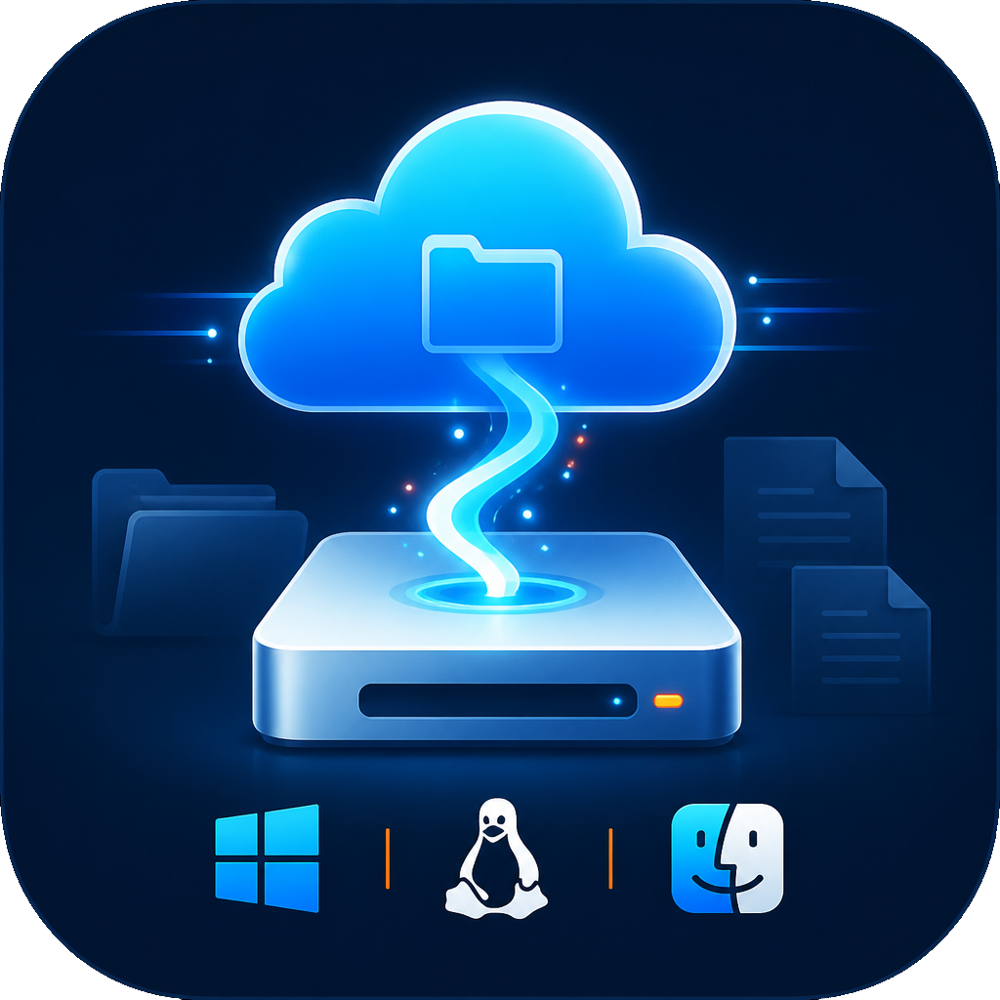

<div align="center">



# GugleFS

</div>

GugleFS 是一个基于 Tauri 的跨平台远程文件系统客户端，目标是将 FTP、SFTP（SSH）和 WebDAV 远程路径映射为本地磁盘或挂载目录。

- Windows：WinFsp
- Linux / macOS：FUSE
- 配置界面：Tauri + TypeScript + Vite
- 文件系统引擎：Rust
- 前端包管理器：pnpm

> 当前 Windows 版本已打通 WebDAV、WinFsp 盘符映射、系统凭据库和启动 2FA。FTP/SFTP 与 Linux/macOS 系统挂载仍在实现中，进度见 `TODO.md`。

## 目录结构

```text
GugleFS/
├─ src/                     # 仅负责配置窗口
├─ src-tauri/               # Tauri 入口与 IPC 命令
├─ crates/
│  ├─ guglefs-core/         # 配置模型、状态和引擎抽象
│  ├─ guglefs-remote/       # FTP / SFTP / WebDAV 适配器
│  └─ guglefs-mount/        # WinFsp / FUSE 平台驱动
├─ Cargo.toml               # Rust workspace
├─ package.json             # pnpm 命令
└─ TODO.md
```

依赖方向固定为：`配置窗口 -> Tauri IPC -> core <- remote / mount`。前端不直接处理网络请求或文件系统操作。

## 开发

需要 Node.js 20+、pnpm 10+、Rust 1.77+，并安装 Tauri 对应平台的系统依赖。

Windows 开发环境还需要：

- Visual Studio Build Tools 2022
- `Desktop development with C++` 工作负载及 Windows 10/11 SDK
- WebView2（现代 Windows 通常已经包含）

安装后请重新打开终端，确认 `cargo` 和 MSVC 的 `link.exe` 可用。构建和使用 Windows 挂载功能还需安装 WinFsp 2.1（开发环境安装 SDK，普通用户安装运行时）。

```bash
pnpm install
pnpm dev
```

仅检查前端和 Rust workspace：

```bash
pnpm check
```

### Windows mount runtime

使用 WebDAV 映射前需安装 [WinFsp 2.1](https://github.com/winfsp/winfsp/releases)。GugleFS 会在挂载时加载 WinFsp，挂载点可以是 `Z:` 这样的盘符，也可以是已存在的绝对目录。

首次启动会引导使用身份验证器注册 TOTP 2FA，之后每次启动都必须输入 6 位验证码。WebDAV 密码可保存到 Windows Credential Manager；应用配置和挂载恢复状态只保存凭据引用和映射 ID，不保存明文密码。

点击“锁定”会先安全卸载当前所有映射，再进入 2FA 锁屏。解锁或重启后，GugleFS 会自动恢复上次仍处于挂载状态且已保存凭据的映射；用户主动点击“卸载”后，该映射不会在下次解锁时恢复（启用了 `auto_mount` 的配置除外）。

开发真实挂载功能前，Linux 需要 FUSE3 开发包；macOS 需要 macFUSE。

## 安全边界

`MappingConfig` 只保存 `credential_id`，不保存密码或私钥口令。WebDAV 密码和 TOTP 密钥保存在 Windows Credential Manager；连接测试和挂载中的密码只通过本次 IPC 请求传递，不会写入配置或返回值。macOS Keychain 和 Linux Secret Service 尚未接入。

映射配置会保存到 Tauri 应用配置目录下的 `mappings.json`，文件包含 `schemaVersion`。用于解锁后恢复的映射 ID 单独保存在 `mount-state.json`，运行时错误和凭据内容不会写入这两个文件。
